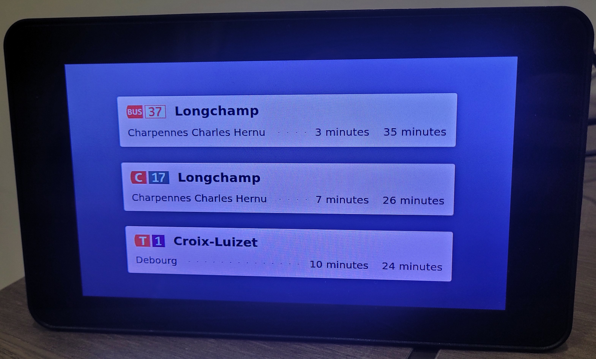

# LITCHI, a TCL Lyon web app

Litchi is a web app to show wait times of Bus, Metro, Trams, or whatever other available transport mode in Lyon's TCL network.

It is meant to be used as a kiosk app. The data is refreshed every minute.

Try it out: https://tcl.vqlion.fr



## Usage 

The app accepts url parameters to define the lines, stops & directions you want to display. The parameters are as follows :

- `line`: line names (e.g. `T4`, `A` or `69`)
- `stops`: stop **ids**
    - You can find the ids on the [data grand lyon website](https://data.grandlyon.com/portail/fr/jeux-de-donnees/points-arret-reseau-transports-commun-lyonnais/donnees) by searching a stop on the map and taking its id (e.g. `30459` is the id of Perrache for the line A). 
    - **Note that an id is tied to the direction of the transport** (it is not the station, but a platform). If you want both directions, you have to take the id of each platform (e.g. `30101` and `30459` for Perrache line A in both directions)
- `directions` (optional): an optional destination stop id
    - If omitted all the directions for a single stop will be displayed. This can be useful if a stop/line has multiple destinations but you only want one 

> Here's an example address: 
> 
> https://tcl.vqlion.fr/?lines=A&lines=T2&lines=C19&lines=49&stops=33777&stops=33775&stops=30101&stops=30459&stops=32102&stops=32103

## Installation

You need a data GrandLyon account. You can create one on their [website](https://data.grandlyon.com).

Then, copy the `.env.example` file in a `.env` and fill in your username and password.

### Docker

```sh
docker compose build
docker compose up -d
```

### Or just... python, like the tiger you are

Install the dependencies:

```sh
python3 -m venv .venv
source .venv/bin/activate
pip install -r requirements.txt && pip install fastapi[standard]
```

Download and unzip the TCL pictograms to the static directory:
```sh
mkdir -p src/static 
curl -u "$TCL_USER:$TCL_PASS" https://download.data.grandlyon.com/files/rdata/tcl_sytral.tclpictogrammes/Pictogrammes_lignes_complets.zip -o picto.zip
unzip picto.zip -d src/static
rm picto.zip
```

Run the app:

```sh
fastapi run main.py # or fastapi dev main.py for development
```