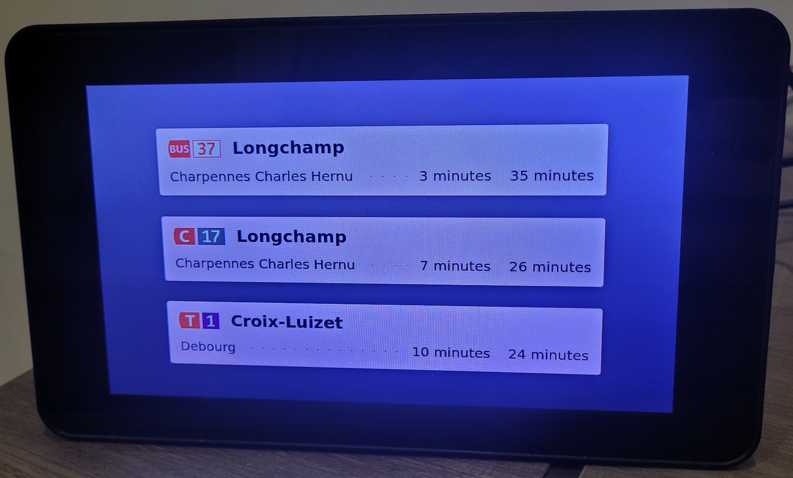

# LITCHI, a TCL Velo'v Lyon web app

Litchi is a web app & helper for transport modes in Lyon. It has three missions:

- to show wait times of Bus, Metro, Trams, or whatever other available transport mode in Lyon's TCL network.
- to show whether Velo'v journeys are possible or not, based on the number of Velo'v & stands on the departing & arrival station.
- to show the current number of spots in the parking relais of the Métropole.

The TCL part is meant to be used as a kiosk app. The data is refreshed every minute.

The Velo'v & Parking parts are intended as a quick checking app on your phone.

Try it out: https://litchi.vqlion.fr/tcl, https://litchi.vqlion.fr/velov & https://litchi.vqlion.fr/park


*Example usage on a raspberry pi with a 7inch touchscreen*

## Usage 

### Velov

The app accepts url parameters to define the journeys. The parameters are a list of pairs of ids of departure & arrival stations.

- `pairs`: ids of the departure & arrival station, in order, separated by a comma (,)

You can find the station ids directly in the Velov app, by clicking on a station (the id is right next to its name).

> Here's an example address. The first pair describes a journey from the station with id 1003 to the station 10021, and so on:
>
> https://litchi.vqlion.fr/velov?pairs=1003,10021&pairs=1012,10043&pairs=10002,10004

### TCL

The app accepts url parameters to define the lines, stops & directions you want to display. The parameters are delimited with commas (,)

- `line`: line names (e.g. `T4`, `A` or `69`)
- `stops`: stop **ids**
    - You can find the ids on the [data grand lyon website](https://data.grandlyon.com/portail/fr/jeux-de-donnees/points-arret-reseau-transports-commun-lyonnais/donnees) by searching a stop on the map and taking its id (e.g. `30459` is the id of Perrache for the line A). 
    - **Note that an id is tied to the direction of the transport** (it is not the station, but a platform). If you want both directions, you have to take the id of each platform (e.g. `30101` and `30459` for Perrache line A in both directions)
- `directions` (optional): an optional destination stop id
    - If omitted all the directions for a single stop will be displayed. This can be useful if a stop/line has multiple destinations but you only want one 

> Here's an example address: 
> 
> https://litchi.vqlion.fr/tcl?lines=A,T2,C19,49&stops=33777,33775,30101,30459,32102,32103

### Parkings relais

The app displays all of the parkings by default. You can filter on a list of parkings by providing a list of parking ids in the `parks` parameters, separated by a comma. 

The parking ids are displayed in the app (right after the parking's name, in parenthesis)

> Here's an example address:
> 
> https://litchi.vqlion.fr/park?parks=CUI,PAR

## Installation

You need a data GrandLyon account. You can create one on their [website](https://data.grandlyon.com).

Then, copy the `.env.example` file in a `.env` and fill in your username and password.

### Docker

```sh
docker compose build
docker compose up -d
```

### Or just... python, like the tiger you are

Install the dependencies:

```sh
python3 -m venv .venv
source .venv/bin/activate
pip install -r requirements.txt
```

Download and unzip the TCL pictograms to the static directory:
```sh
mkdir -p src/static/tcl
curl -u "$GRANDLYON_USER:$GRANDLYON_PASS" https://download.data.grandlyon.com/files/rdata/tcl_sytral.tclpictogrammes/Pictogrammes_lignes_complets.zip -o picto.zip
unzip picto.zip -d src/static/tcl
rm picto.zip
```

Run the app:

```sh
fastapi run main.py # or fastapi dev main.py for development
```